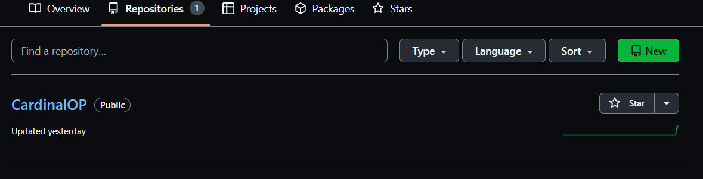
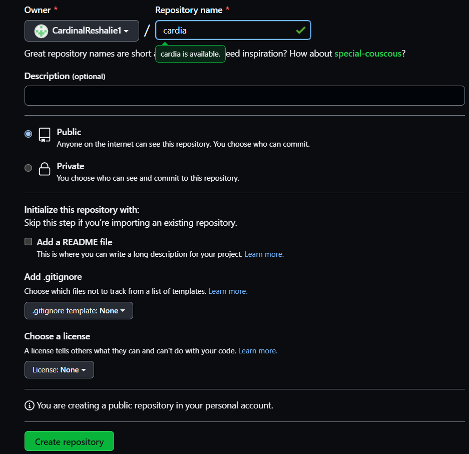
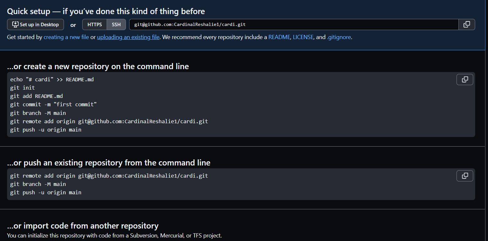

Инструкция как пользоваться Git!
===
Установка Git! Скачиваем Git для вашей операционной системы по ссылке https://git-scm.com/downloads
Для MacOS советую скачать Homebrew очень удобный менеджер пакетов который вам поможет! для Linux по ссылке выше.

После установки Git вам необходимо связать его с вашим редактором кода. Для удобства возьмем VSCode. Скачать можете по ссылке https://code.visualstudio.com/

Далее необходимо создать папку(репозиторий) и внутри папки сделать файл в формате (ваше название).md После открываем терминал и VSCod'e и прописываем две важные строки:

1.   $ git config --global user.name "Ваше имя"
2.   $ git config --global user.email "Ваш емаил"

>без этих команд Git не будет работать!

>Далее прописываем git Init для инициализации локального репозитория,

>Потом git add . добавляет файлы к следующему коммиту

>И сам git commit -m "message" Создает коммит с вашим сообщением

О подключении к github:
===
Что бы подлючить свой Git локальный (на компуктере) к github'y необходимо:

>Создать аккаунт на https://github.com/

>Зайти во вкладку repositories

>создать NEW repositories

>Пишем название нашего репозитория и нажимаем создать.

Далее вписываем появляется следующая страница, из этого нам важно ...or push an existing repository from the command line.

>git remote add origin git@github.com:CardinalReshalie1/cardi.git

>git branch -M main

>git push -u origin main

Поздравляю, теперь ваш локальный репозиторий находится на Github.
---

(если у вас появились ошибки, то интернет вам в помощь!)
---

Так же основные команды:
===

✦ git init – инициализация локального репозитория

---
✦ git status – получить информацию от git о его текущем состоянии

---

✦ git add – добавить файл или файлы к следующему коммиту

---
✦ git commit -m “message” – создание коммита.

---
✦ git log – вывод на экран истории всех коммитов с их хеш-кодами

---
✦ git checkout – переход от одного коммита к другому

---
✦ git checkout master – вернуться к актуальному состоянию и продолжить работу

---
✦ git diff – увидеть разницу между текущим файлом и закоммиченным файлом

---
Немного о markdown
===
Блочные элементы:

Параграфы и разрывы строк;

при
мер происходит засчет добавления (/br/)

Заголовки; и Выделение текста;

Добавив определенные символы, вы получаете разные способы выделения текста!

#fact#
-
##fact##
-
###fact###
--

**and** (** В начале и в конце**)

__and__ (__ В начале и в конце__)

*and* (* В начале и в конце*)

~~and~~ (~~ В начале и в конце ~~)

***and*** (*** В начале и в конце***)

Цитаты;
>пример цитаты (> в начале) где каждая строка отдельно

и есть вложенные цитаты

>1 (> в начале)

>>2 (>> в начале)

>>>3 (>>> в начале)

Списки
упорядоченные списки

1.   (1. три пробела и ваш спосок)
2.   
3.   
неупорядоченные списки

*    (* ... и ваш список)
*   
или

-  (- ... и ваш список)
-   
-   
или

+   (+ ... и ваш список)
+   

---
Блоки кода;
Горизонтальные (разделительные) линии. (--- под вашим текстом)

Ссылки;
Markdown поддерживает два стиля оформления ссылок:  
Гиперссылка, с немедленным указанием адреса (внутритекстовая); Гиперссылка, подобная сноске.
Подразумевается, что помимо URL-адреса существует еще текст ссылки. Он заключается в квадратные скобки. Для создания внутритекстовой гиперссылки необходимо использовать круглые скобки сразу после закрывающей квадратной. Внутри них необходимо поместить URL-адрес. В них же возможно расположить название, заключенное в кавычки, которое будет отображаться при наведении, но этот пункт не является обязательным. пример
При создании сносной гиперссылки вместо целевого адреса используется вторая пара квадратных скобок, внутри которых помещается метка, идентификатор ссылки (id).
пример: http://example.com/

Кодовые фрагменты строк;
Чтобы отметить фрагмент строки, содержащий код, необходимо окружить его обратными апострофами «`». При использовании кодовых фрагментов строк текст будет отображаться в виде моноширинного шрифта. В отличие от блоков кода, кодовый фрагмент позволяет поместить код внутрь обычного абзаца текста. Кодовый фрагмент строки в языке Markdown выглядит следующим образом:

использование оператора if

Изображения:
С помощью непосредственного указания URL-адреса изображения. Синтаксис данной команды выглядит следующим образом:Альтернативный текст

Альтернативный текст

Альтернативный текст

Дополнительные элементы
Может употребляться в Markdown перед специальными символами для того, чтобы они воспринимались в их буквальном (а не служебном) значении. Полный список данных символов приводится ниже:

«\» - слеш;

«`» - обратный апостроф;

«*» - звездочка;

«_» - символ подчеркивания;

«{}» - фигурные скобки;

«[]» - квадратные скобки;

«()» - круглые скобки;

«#» - символ решетки;

«+» - плюс;

«-» - минус (дефис);

«.» – точка;

«!» - восклицательный знак.

[Автоматические ссылки](#Automatic Links);
Markdown поддерживает упрощённый порядок автоматического создания ссылок для URL-адресов и адресов электронной почты. Для этого достаточно поместить URL-адрес или почтовый адрес в угловые скобки, и Markdown сделает его гиперссылкой. В отличие от вышеописанных стилей, в данном случае сам же URL-адрес или почтовый адрес становится и текстом гиперссылки. Автоматические ссылки на адреса электронной почты работают аналогично. Автоматические ссылки в языке Markdown выглядят следующим образом http://example.com/

Специальные символы HTML.
В языке HTML существует два символа, требующих специального рассмотрения: это символы («<») и («&»). Левая угловая скобка используется как начало тэга; амперсанды применяются для обозначения специального символа HTML. Для того чтобы использовать эти символы в их буквальном смысле, необходимо заменить их элементами HTML, а именно < и & соответственно. При использовании Markdown подобных действий совершать не нужно. Он позволяет использовать эти символы в исходном виде. В случае если амперсанд используется как часть спецсимвола HTML, он останется неизменным. В противном случае Markdown преобразует его в &.